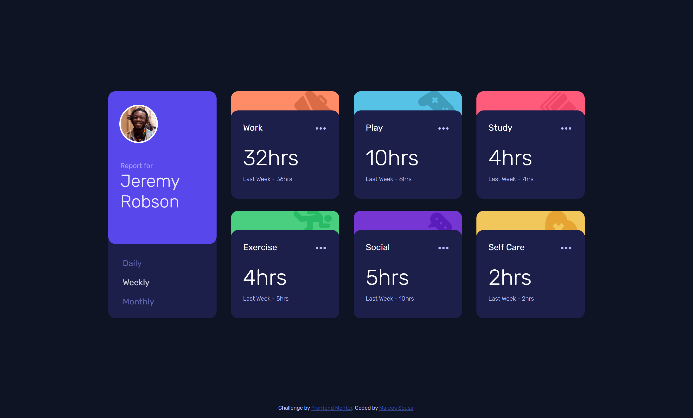
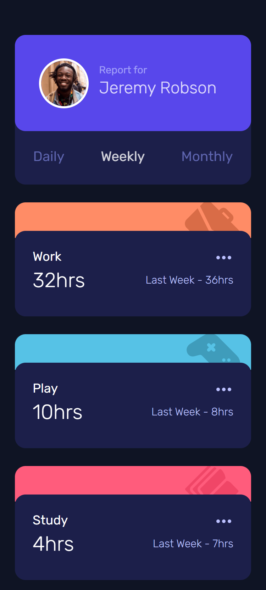
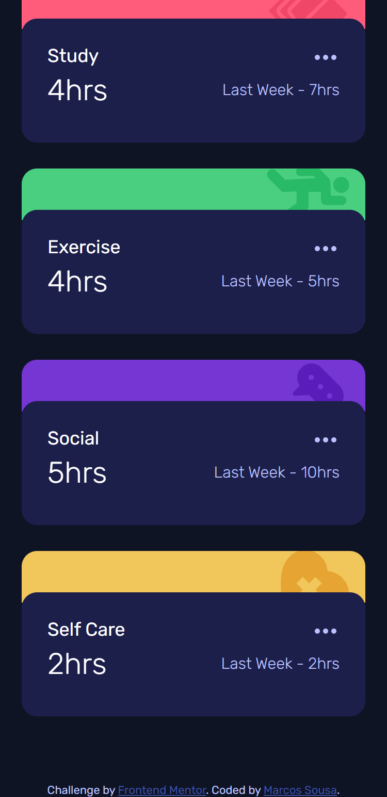

# Frontend Mentor - Time tracking dashboard solution

This is a solution to the [Time tracking dashboard challenge on Frontend Mentor](https://www.frontendmentor.io/challenges/time-tracking-dashboard-UIQ7167Jw). Frontend Mentor challenges help you improve your coding skills by building realistic projects. 

## Table of contents

- [Overview](#overview)
  - [The challenge](#the-challenge)
  - [Screenshot](#screenshot)
  - [Links](#links)
- [My process](#my-process)
  - [Built with](#built-with)
  - [What I learned](#what-i-learned)
  - [Continued development](#continued-development)
  - [Useful resources](#useful-resources)
- [Author](#author)

## Overview

### The challenge

Users should be able to:

- View the optimal layout for the site depending on their device's screen size
- See hover states for all interactive elements on the page
- Switch between viewing Daily, Weekly, and Monthly stats

### Screenshot






### Links

- Solution URL: [https://www.frontendmentor.io/challenges/time-tracking-dashboard-UIQ7167Jw/hub/time-tracking-dashboard-app-with-local-json-fetch-api-asyncawait-qeVO1ak5x]
- Live Site URL: [https://marcosfsousa.github.io/time-tracking-dashboard/]

## My process

### Built with

- Semantic HTML5 markup
- CSS custom properties
- Flexbox
- CSS Grid
- Mobile-first workflow
- Fetch API with local JSON data file
- Async/Await function

### What I learned

Learned how to fetch and manipulate data on a JSON file;
Ternary operators with string concatenation;
Using ```forEach()``` for ease array traversal

Here follow some examples of the above:

```js
async function requestData() {
    const response = await fetch('./data.json');
    const data = await response.json();
}

requestData();

```

```js

dailyBtn.addEventListener("click", event => {
  themeCardAll.forEach( element => { // iteration through all theme-cards //
    for (let i = 0; i < data.length; i++) {
      paraCurrent[i].textContent = data[i].timeframes.daily.current + (data[i].timeframes.daily.current > 1 ? "hrs" : "hr");
      spanPrevious[i].textContent = "Last Week - " + data[i].timeframes.daily.previous + (data[i].timeframes.daily.previous > 1 ? "hrs" : "hr");
    }
  });
  changeActive(dailyBtn, weeklyBtn, monthlyBtn);
  event.preventDefault();
});

```

### Continued development

I hope that all of the tools I mentioned above I'll be able to use in future projects as I feel they streamline workflow, code reusability and legibility.

### Useful resources

- [JSON - Working with Data and APIs in JavaScript by The Coding Train](https://www.youtube.com/watch?v=uxf0--uiX0I) - This was very useful to understand how the Fetch API works and how to use async/await function in Javascript.

## Author

- Website - [Marcos Sousa](https://marcosfsousa.github.io/WebCV/)
- Frontend Mentor - [@marcosfsousa](https://www.frontendmentor.io/profile/marcosfsousa)
- LinkedIn - [omarcossousa](https://www.linkedin.com/in/omarcossousa)


